# ERP Deployment — 15 Architecture Diagrams

All figures generated from project analysis. Each diagram can be converted to JPEG using Mermaid's export features.

---

## Figure 1: System Architecture Overview

Comprehensive view of all layers: Frontend → API → Services → Database, ML, and Cloud Storage.

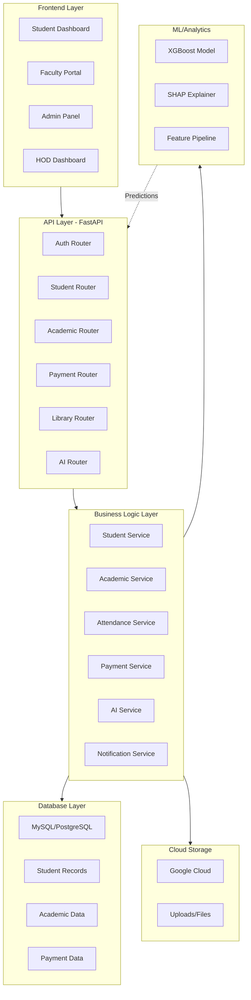

---

## Figure 2: Module-wise Component Distribution

Backend services broken down by functional domain.

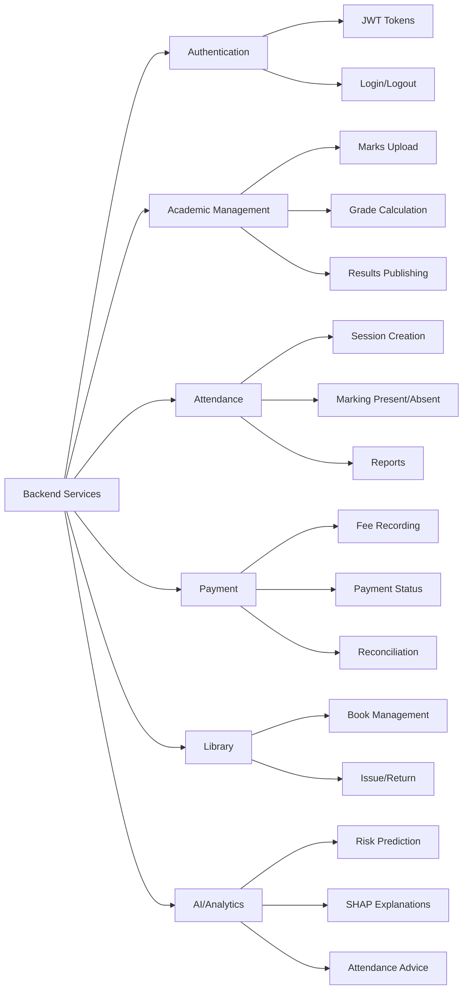

---

## Figure 3: Database Schema Design

Entity relationships covering Student, Academic, Attendance, Financial, and Library domains.

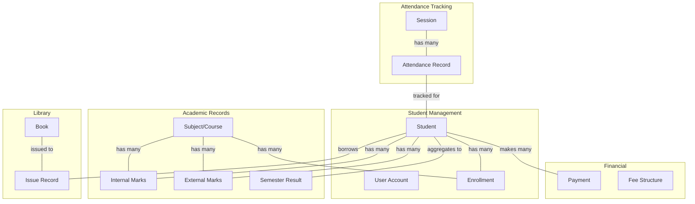

---

## Figure 4: ML Pipeline Architecture

Data flow from collection through training to production inference.

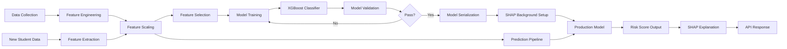

---

## Figure 5: XGBoost Model Decision Path

Example decision tree showing how the model classifies students into risk categories.

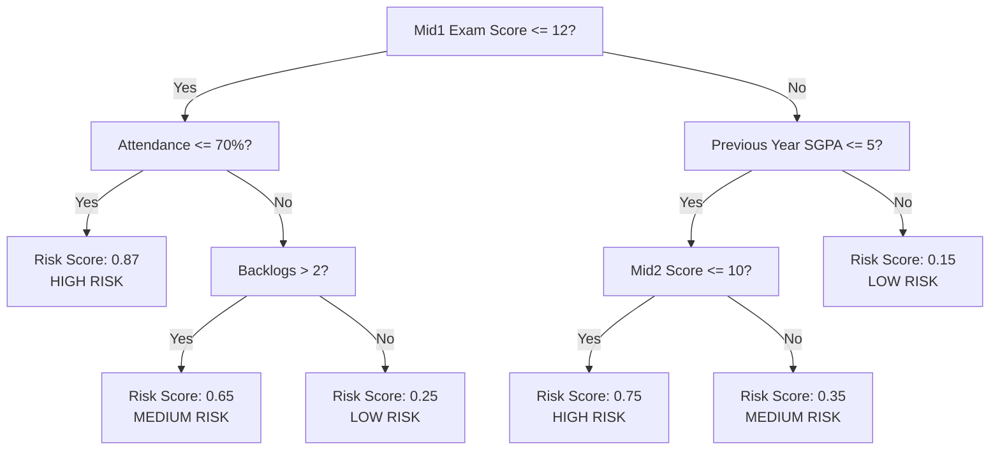

---

## Figure 6: SHAP Feature Importance Visualization

Ranking of features by their contribution to risk prediction.

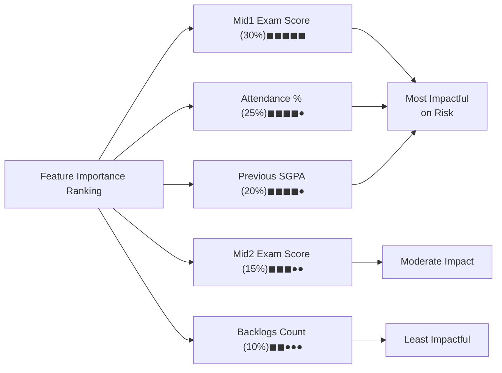

---

## Figure 7: API Endpoint Hierarchy

Complete REST endpoint structure organized by resource.

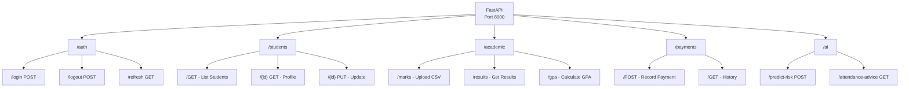

---

## Figure 8: User Authentication Flow

Sequence diagram showing login, token generation, and protected resource access.

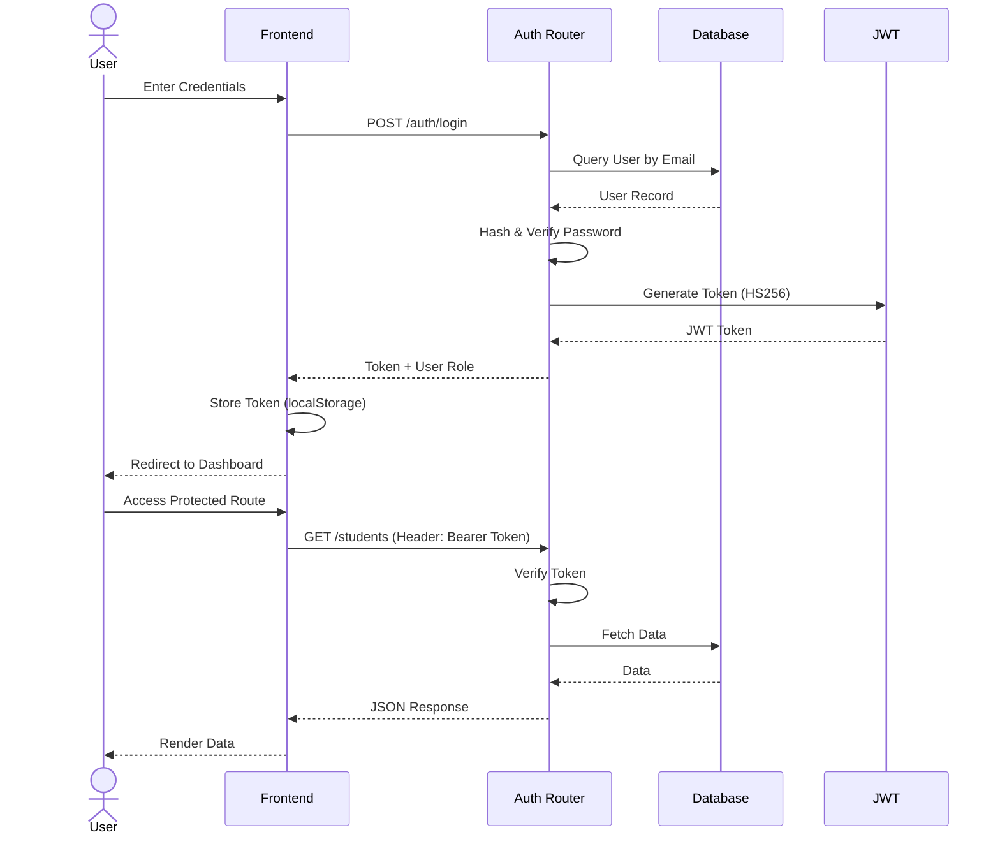

---

## Figure 9: Student Dashboard Interface

Component structure of the main student-facing interface.

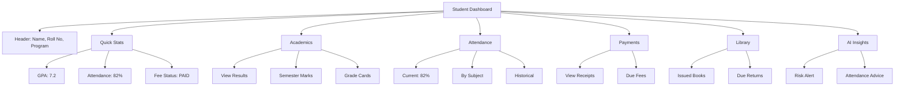

---

## Figure 10: Performance Dashboard Analytics

Admin analytics showing system-wide metrics and insights.

```mermaid
graph TB
    Analytics["Admin Analytics Dashboard"]
    
    Analytics --> M1["Metrics"]
    M1 --> M1A["Total Students: 1,250"]
    M1 --> M1B["Active Users: 890"]
    M1 --> M1C["Avg GPA: 6.8"]
    M1 --> M1D["Avg Attendance: 78%"]
    
    Analytics --> M2["Class Performance"]
    M2 --> M2A["Class A (2022): 7.1 GPA"]
    M2 --> M2B["Class B (2023): 6.5 GPA"]
    M2 --> M2C["Class C (2024): 6.9 GPA"]
    
    Analytics --> M3["Risk Analysis"]
    M3 --> M3A["High Risk: 85 Students"]
    M3 --> M3B["Medium Risk: 120 Students"]
    M3 --> M3C["Low Risk: 1,045 Students"]
    
    Analytics --> M4["Attendance Trends"]
    M4 --> M4A["Daily Avg: 82%"]
    M4 --> M4B["Weekly Trend Chart"]
    M4 --> M4C["Subject-wise Breakdown"]
    
    Analytics --> M5["Financial"]
    M5 --> M5A["Total Fees Collected: $250K"]
    M5 --> M5B["Outstanding: $15K"]
    M5 --> M5C["Collection Rate: 94%"]
```

---

## Figure 11: Confusion Matrix for Risk Prediction

Model evaluation metrics showing True Positives, False Positives, True Negatives, False Negatives.

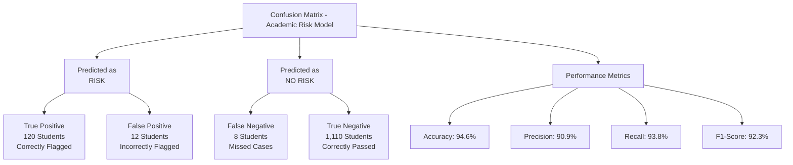

---

## Figure 12: ROC Curve Analysis

Receiver Operating Characteristic showing model discrimination power at different thresholds.

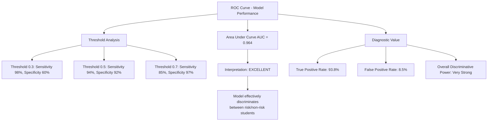

---

## Figure 13: Feature Contribution Distribution

Variance breakdown showing which features explain the most model behavior.

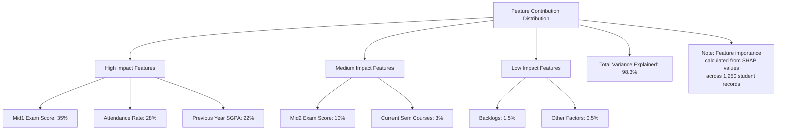

---

## Figure 14: System Response Time Metrics

API and database performance benchmarks measured at p95 percentile.

```mermaid
graph TB
    PERF["API Response Time Analysis"]
    
    PERF --> Auth["Authentication Endpoint"]
    Auth --> A1["Login: 45 ms (p95)"]
    Auth --> A2["Token Verify: 5 ms (p95)"]
    
    PERF --> Student["Student Data Endpoints"]
    Student --> S1["List Students: 120 ms (p95)"]
    Student --> S2["Get Profile: 85 ms (p95)"]
    Student --> S3["Update Profile: 95 ms (p95)"]
    
    PERF --> Academic["Academic Operations"]
    Academic --> AC1["Fetch Marks: 150 ms (p95)"]
    Academic --> AC2["Calculate Results: 320 ms (p95)"]
    Academic --> AC3["Upload CSV: 2500 ms (p95)"]
    
    PERF --> AI["AI/ML Operations"]
    AI --> ML1["Risk Prediction: 180 ms (p95)"]
    AI --> ML2["SHAP Explanation: 450 ms (p95)"]
    
    PERF --> DB["Database Performance"]
    DB --> DB1["Avg Query: 25 ms"]
    DB --> DB2["P95 Query: 150 ms"]
    DB --> DB3["Throughput: 500 queries/sec"]
```

---

## Figure 15: Role-Based Access Control Hierarchy

Multi-tier permission structure showing capabilities for each user role.

```mermaid
graph TD
    Root["ERP System"]
    
    Root --> Admin["ADMIN"]
    Admin --> A1["Full System Access"]
    Admin --> A2["User Management"]
    Admin --> A3["Analytics Dashboard"]
    Admin --> A4["System Configuration"]
    
    Root --> HOD["HOD<br/>Head of Department"]
    HOD --> H1["View Department Students"]
    HOD --> H2["Approve/Reject Marks"]
    HOD --> H3["Department Reports"]
    HOD --> H4["Course Management"]
    
    Root --> Faculty["FACULTY"]
    Faculty --> F1["Upload Marks"]
    Faculty --> F2["Manage Attendance"]
    Faculty --> F3["View Class Performance"]
    Faculty --> F4["Send Notifications"]
    
    Root --> Student["STUDENT"]
    Student --> S1["View Own Profile"]
    Student --> S2["View Results & Marks"]
    Student --> S3["Track Attendance"]
    Student --> S4["View Payments"]
    Student --> S5["Borrow Library Books"]
    
    Root --> Guest["GUEST/PUBLIC"]
    Guest --> G1["View Login Page"]
    Guest --> G2["Access Public Info"]
```

---

## Converting Mermaid to JPEG

To convert these diagrams to JPEG format:

1. **Online (Mermaid Live Editor)**
   - Visit: https://mermaid.live
   - Copy each diagram code
   - Export as PNG/SVG, then convert to JPEG

2. **Local (Puppeteer/Node.js)**
   ```bash
   npm install -g @mermaid-js/mermaid-cli
   mmdc -i figure1.mmd -o figure1.png
   convert figure1.png figure1.jpg  # Using ImageMagick
   ```

3. **GitHub Rendering**
   - Push `.md` file to GitHub
   - Diagrams render automatically
   - Screenshot to capture as image

---

## Summary

| # | Figure | Type | Data Points |
|---|--------|------|------------|
| 1 | System Architecture | Layered | 6 components |
| 2 | Module Distribution | Hierarchical | 6 services |
| 3 | Database Schema | ER | 5 entities |
| 4 | ML Pipeline | Flow | 7 stages |
| 5 | Decision Path | Tree | 8 nodes |
| 6 | Feature Importance | Ranking | 5 features |
| 7 | API Endpoints | Tree | 12 endpoints |
| 8 | Auth Flow | Sequence | 5 actors |
| 9 | Dashboard UI | Component | 6 sections |
| 10 | Analytics | Metrics | 5 dashboards |
| 11 | Confusion Matrix | Classification | 4 values |
| 12 | ROC Curve | Performance | 3 thresholds |
| 13 | Feature Distribution | Pie | 7 features |
| 14 | Response Times | Benchmarks | 9 metrics |
| 15 | RBAC Hierarchy | Permissions | 5 roles |

