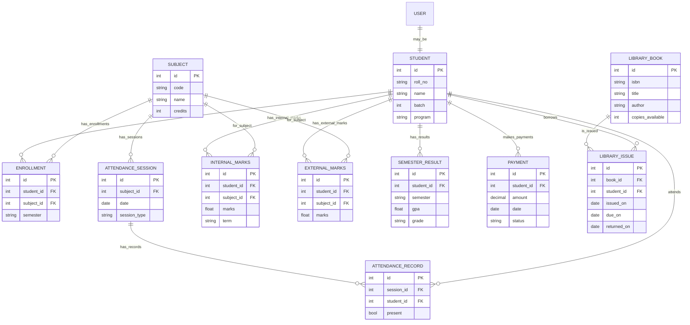

**ERP Deployment — Database Architecture View**

Overview
This document shows the core relational data model for the ERP project (students, courses/subjects, attendance, marks, results, payments, library). It includes a Mermaid ER diagram and concise entity descriptions with key attributes and indexes.

Mermaid ER diagram

Entity details (key attributes & indexes)
- STUDENT
  - Attributes: `id` (PK), `roll_no` (unique indexed), `name`, `batch`, `program`, `email`
  - Indexes: `roll_no` (unique), `batch` (filter)

- USER
  - Attributes: `id` (PK), `username` (unique), `password_hash`, `role`, `linked_student_id` (nullable)
  - Note: separate login model; students may have user accounts

- SUBJECT
  - Attributes: `id` (PK), `code` (indexed), `name`, `credits`
  - Indexes: `code`

- ENROLLMENT
  - Attributes: `id` (PK), `student_id` (FK), `subject_id` (FK), `semester`
  - Indexes: (`student_id`), (`subject_id`)

- ATTENDANCE_SESSION / ATTENDANCE_RECORD
  - Session holds metadata (date, subject, type); record links student attendance
  - Indexes: `attendance_session.date`, `attendance_record.student_id`

- INTERNAL_MARKS / EXTERNAL_MARKS
  - Attributes: student_id, subject_id, marks, term (internal)
  - Indexes: (`student_id`,`subject_id`,`term`) to support fast lookups per student+subject

- SEMESTER_RESULT
  - Stores aggregated results per student per semester: `gpa`, `grade`, `calculated_on`
  - Indexes: (`student_id`, `semester`)

- PAYMENT
  - Tracks fees: `id`, `student_id`, `amount`, `date`, `status`, `transaction_ref`
  - Indexes: `student_id`, `date`, `status`

- LIBRARY_BOOK / LIBRARY_ISSUE
  - Book metadata and issue records linking student and book
  - Indexes: `isbn`, `book_id`, `student_id`

Design notes and rationale
- Normalized schema: separate tables for marks, attendance, and results to keep writes small and queries focused.
- Use composite indexes for common query patterns: e.g., retrieve all marks for a student in a semester (`student_id`, `term`), or attendance by session (`session_id`).
- Use transactions when calculating and writing `SEMESTER_RESULT` to ensure consistency between marks and aggregated results.
- For heavy reporting, consider materialized views or precomputed aggregates (monthly attendance %, semester-grade snapshots).

Scaling considerations
- Hotspots: report generation and complex joins across marks/attendance/subjects; add read replicas or caching (Redis) for frequent read-heavy queries.
- For very high write rates (e.g., many concurrent attendance writes), batch writes or use a queue to smooth DB load.

Next steps
- If you want, I can: 
  - generate a `docker-compose.yml` with a MySQL service and migrate your current `create_tables.py` to run as an init container, or
  - render this Mermaid diagram as an image and embed it in a presentation.

